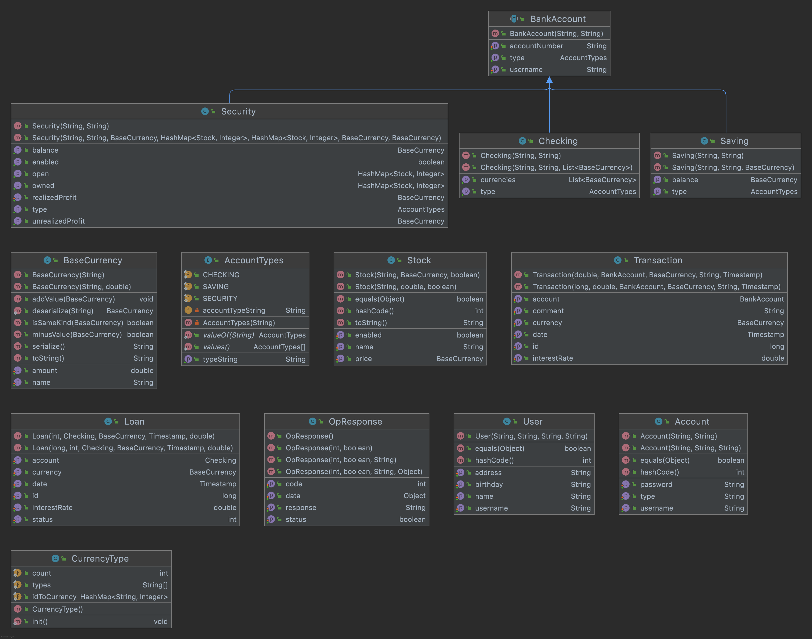
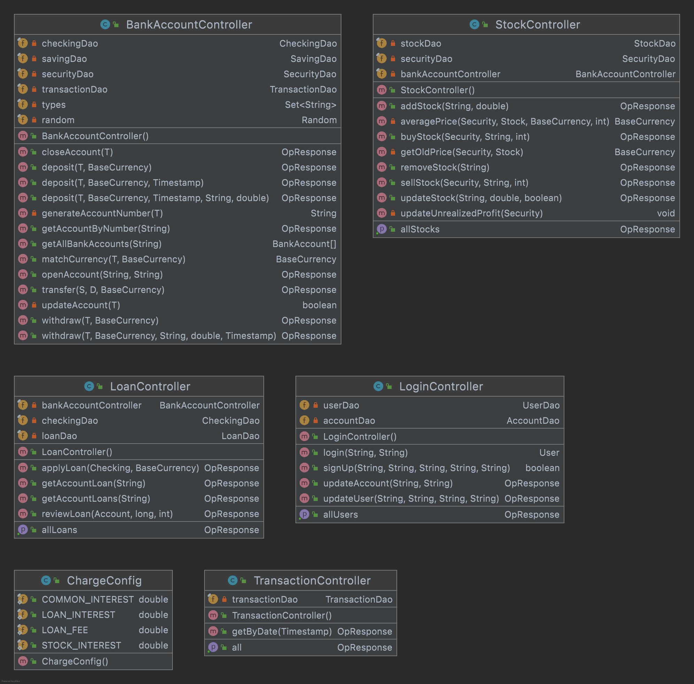
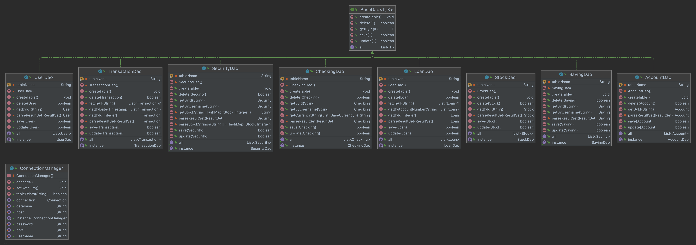
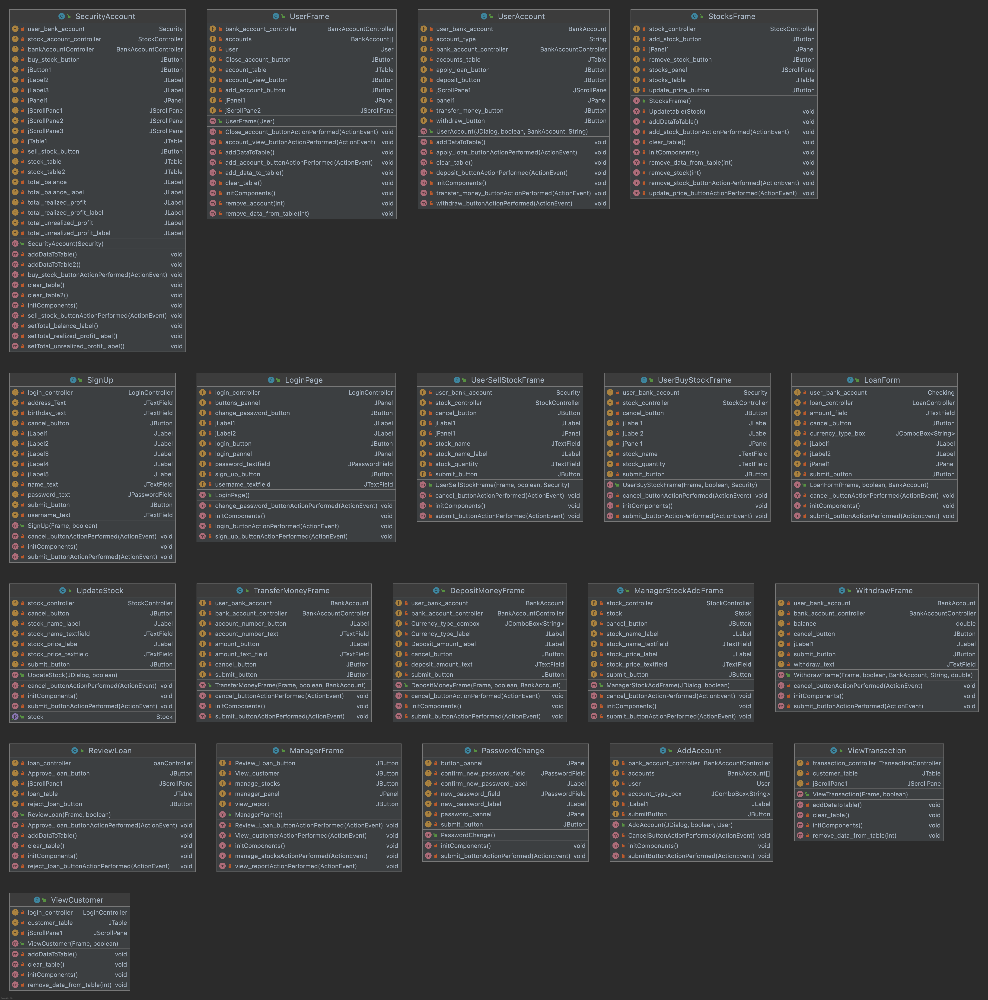

# Abstract
Our program uses Model-View-Controller(-DAO) architecture, combined with PostgreSQL.
For DAO specifically, we use singleton.

We first design the data structures(DB tables) for the objects that will appear in the program.
The Models are created for different tables of the database. The Views are the GUIs
for users to interact with. The Controllers are responsible for the logical processes
of data. The DAOs are responsible for communicating with the database, retrieving or 
updating the data.

## UMLs

### Models


### Controllers


### DAOs


### Views


## Models
```AccountTypes.java```          The types for BankAccount.

```BaseCurrency.java```          The currency.

```CurrencyType.java```          All types of currencies.

```User.java```                  The model for User.

```Loan.java```                  The model for Loan.

```Account.java```               The model for Login Account

```OpResponse.java```            The model for common response of operations.

```BankAccount.java```           The base model for bank accounts.

```Security.java```              The model for security account.

```Saving.java```                The model for saving account.

```Checking.java```              The model for checking account.

```Stock.java```                 The model for stocks.

```Transaction.java```           The model for transactions.

## Views
```UserFrame.java```             The page after a user logs in.
    
```UserSellStockFrame.java```    The dialog window for the user to sell stock.
    
```PasswordChange.java```        The page for the user to change his password.
    
```UserBuyStockFrame.java```     The page for the user to buy stocks.
    
```AddAccount.java```            The page for the user to create new ban accounts.
    
```UpdateStock.java```           The dialog for changing information about the stock.
    
```ManagerFrame.java```          The page after a manager logs in.
    
```SecurityAccount.java```       The page displaying security account details.
    
```LoginPage.java```             The beginning page.
    
```StocksFrame.java```           The page for managing the stock.

```ManagerStockAddFrame.java```  The page for adding a stock.

```UserAccount.java```           The page displaying checking account details.

```SignUp.java```                The signup page.

```DepositMoneyFrame.java```     Page for depositing.

```TransferMoneyFrame.java```    Page for transferring money.

```WithdrawFrame.java```         Page for withdrawing money.


## Controllers

```ChargeConfig.java```          Configs for interest/ratios of fees.

```LoanController.java```        The controller for operations for loans.

```BankAccountController.java``` The controller for operations for bank accounts.

```TransactionController.java``` The controller for operations for Transactions.

```LoginController.java```       The controller for operations for user accounts.

```StockController.java```       The controller for operations for stocks.


## DAO(Data Access Objects)

```SecurityDao.java```           CRUD for security accounts.

```LoanDao.java```               CRUD for loans.

```CheckingDao.java```           CRUD for checking accounts.

```UserDao.java```               CRUD for users.

```BaseDao.java```               Base CRUD.

```TransactionDao.java```        CRUD for transactions.

```StockDao.java```              CRUD for stocks.

```ConnectionManager.java```     DB Connection manager.

```SavingDao.java```             CRUD for saving accounts.

```AccountDao.java```            CRUD for login accounts.